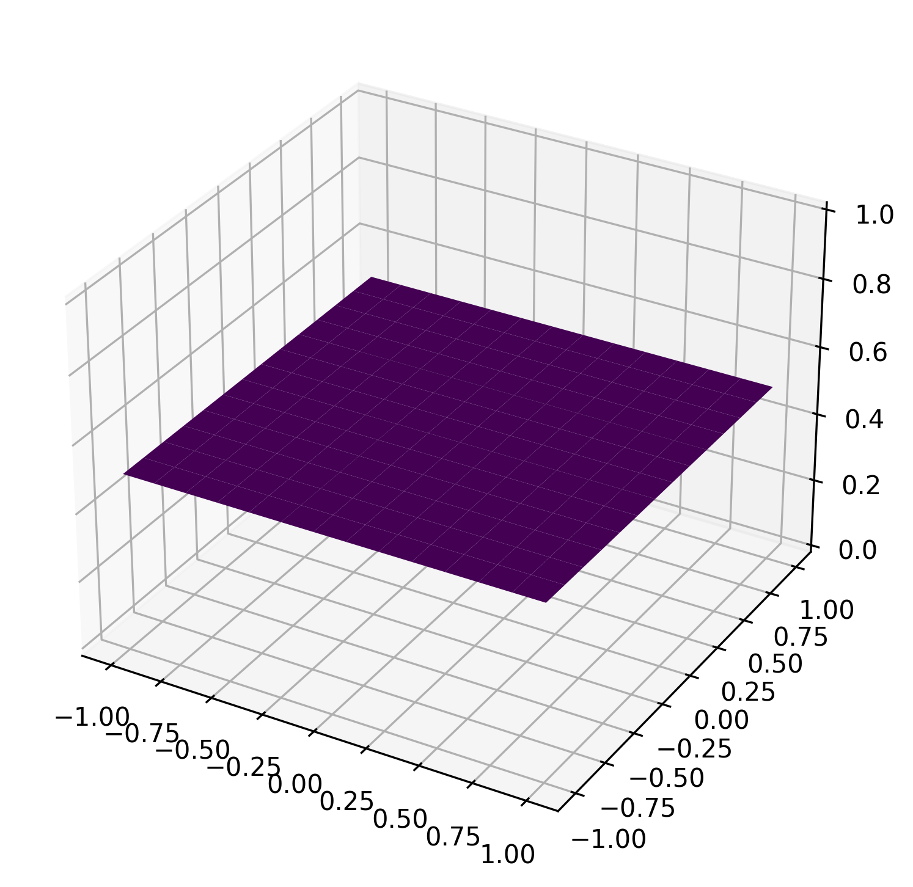
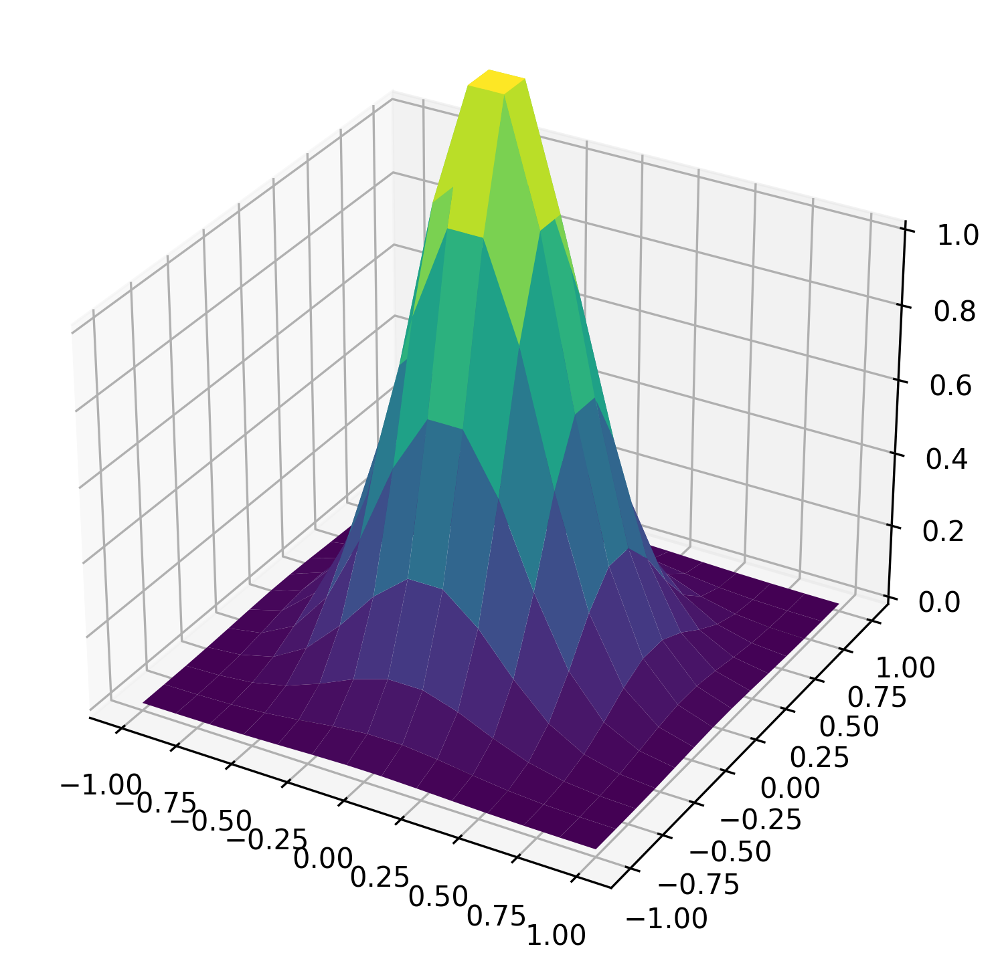
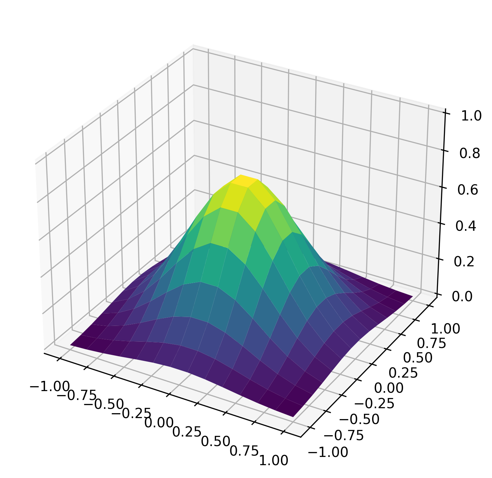
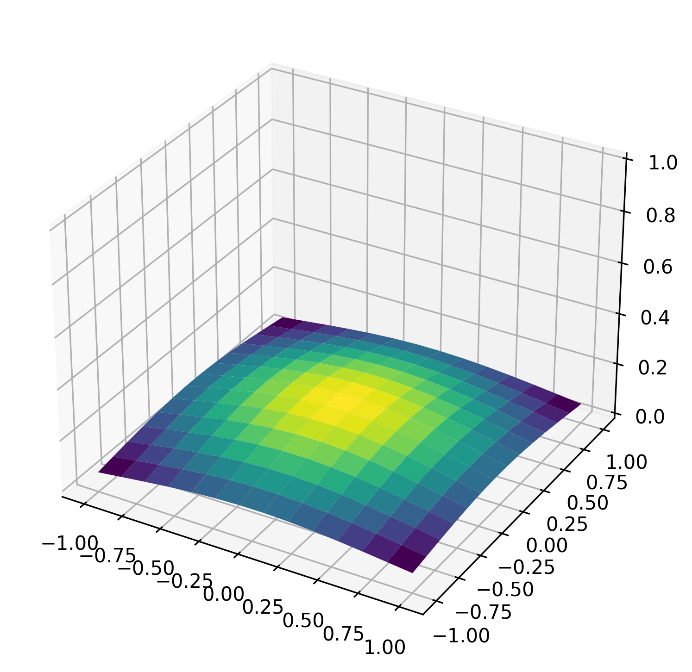

# GLIP: Centered Masking for Language-Image Pre-Training 


[Our paper](https://arxiv.org/abs/2403.15837) is accepted by ECML 2024.

# Abstract
We introduce Gaussian masking for Language-Image Pre-Training (GLIP) a novel, straightforward, and effective technique for masking image patches during pre-training of a vision-language model. GLIP builds on Fast Language-Image Pre-Training (FLIP), which randomly masks image patches while training a CLIP model. GLIP replaces random masking with centered masking, that uses a Gaussian distribution and is inspired by the importance of image patches at the center of the image. GLIP retains the same computational savings as FLIP, while improving performance across a range of downstream datasets and tasks, as demonstrated by our experimental results. We show the benefits of GLIP to be easy to obtain, requiring no delicate tuning of the Gaussian, and also applicable to data sets containing images without an obvious center focus.

# Method

| (a) Random Masking | (b) Gaussian Masking Sigma=0.1 | (c) Gaussian Masking Sigma=0.2 | (d) Gaussian Masking Sigma=0.8 |
|:-------------------------:|:--------------------------:|:--------------------------:|:--------------------------:|
|  |  |  |  |

*Comparison of Random and Gaussian Masking Strategies.*
Image (a) demonstrates a random masking strategy with uniform masking probability. 
Images (b), (c), and (d) illustrate Gaussian masking with increasing standard deviations ($\sigma$),
showcasing the effect of masking that is focused in the centerand gradually spreads to the edges. 


# Results

We will pre-train the model based on the following code and settings [Open_clip](https://github.com/mlfoundations/open_clip)

**Zero-shot accuracy on ImageNet1K classification.**
We pre-trained the model for 30 epochs on the CC12M dataset by different image patch mask ratios with ViT-B/16 as the image encoder. Then we fine-tuned the FLIP and GLIP by an additional epoch.

| Method | Masking Ratio | Inference | Unmasking | After Tuning |
|--------|---------------|-----------|-----------|--------------|
| CLIP   | -             | -         | 36.5      | -            |
| RECLIP | 160 x 160     | -         | 36.6      | 37.4         |
| FLIP   | 50%           | 33.9      | 36.1      | 36.2         |
| GLIP   | 50%           | 35.4      | 37.1      | 37.2         |
|--------|---------------|-----------|-----------|--------------|
| RECLIP | 112 x 112     | -         | 33.0      | 33.4         |
| FLIP   | 75%           | 28.2      | 32.0      | 32.6         |
| GLIP   | 75%           | 30.8      | 33.9      | 34.0         |
|--------|---------------|-----------|-----------|--------------|
| RECLIP | 64 x 64       | -         | 24.9      | 25.6         |
| FLIP   | 91.8%         | 17.9      | 23.5      | 24.5         |
| GLIP   | 91.8%         | 22.1      | 18.6      | 28.0         |
|--------|---------------|-----------|-----------|--------------|


We pre-trained the model for 6 epochs on the Laion400M dataset by 91.8% image patch mask ratios with ViT-B/16 as the image encoder. Then we fine-tuned the RECLIP, FLIP and GLIP by a 0.4 epoch.
For the Laion400M dataset, we successfully download 297M data.

| Method | Masking Ratio | Inference | Unmasking | After Tuning |
|--------|---------------|-----------|-----------|--------------|
| RECLIP | 64 x 64       | -         | 49.1      | 56.8         |
| FLIP   | 91.8%         | 34.2      | 42.5      | 52.7         |
| GLIP   | 91.8%         | 38.7      | 23.5      | 56.6         |
|--------|---------------|-----------|-----------|--------------|

# Pre-training

Follow the instruction of [OpenCLIP](https://github.com/mlfoundations/open_clip) to pre-train the model with Patch Dropout.

Pre-training [FLIP](https://github.com/facebookresearch/flip/tree/main)


```bash
cd open_clip/src
torchrun --nproc_per_node=4 \
    -m training.main \
    --train-data '/data/cc12m/cc12m-train-{0000..2175}.tar' \
    --train-num-samples 10968539 \
    --dataset-type webdataset \
    --model=ViT-B-16 \
    --aug-cfg scale='(0.50, 1.0)' \
    --batch-size 320 \
    --force-patch-dropout 0.50 \
    --lr 1e-3 \
    --precision amp \
    --workers 4 \
    --imagenet-val /data/imagenet/validation/
```

Pre-training RELIP

```bash
cd open_clip/src
torchrun --nproc_per_node=4 \
    -m training.main \
    --train-data '/data/cc12m/cc12m-train-{0000..2175}.tar' \
    --train-num-samples 10968539 \
    --dataset-type webdataset \
    --model=ViT-B-16 \
    --aug-cfg scale='(0.50, 1.0)' \
    --batch-size 320 \
    --force-image-size 160 \
    --lr 1e-3 \
    --precision amp \
    --workers 4 \
    --imagenet-val /data/imagenet/validation/
```

Pre-training GLIP

```bash
cd open_clip/src
torchrun --nproc_per_node=4 \
    -m training.main \
    --train-data '/data/cc12m/cc12m-train-{0000..2175}.tar' \
    --train-num-samples 10968539 \
    --dataset-type webdataset \
    --model=ViT-B-16 \
    --aug-cfg scale='(0.50, 1.0)' \
    --batch-size 320 \
    --force-patch-dropout 0.50 \
    --lr 1e-3 \
    --normal-masking \
    --precision amp \
    --workers 4 \
    --imagenet-val /data/imagenet/validation/
```

# Unmasked tuning

```bash
cd open_clip/src
torchrun --nproc_per_node=4 \
    -m training.main \
    --train-data '/data/cc12m/cc12m-train-{0000..2175}.tar' \
    --train-num-samples 10968539 \
    --dataset-type webdataset \
    --model=ViT-B-16 \
    --aug-cfg scale='(0.50, 1.0)' \
    --pretrained /path/to/checkpoints/epoch_K.pt
    --batch-size 160 \
    --lr 1e-5 \
    --precision amp \
    --workers 4 \
    --imagenet-val /data/imagenet/validation/
```

# Evaluation

We use [CLIP_benchmark](https://github.com/LAION-AI/CLIP_benchmark/tree/main) to evaluate CLIP, FLIP and GLIP on a standard set of datasets on different tasks.
